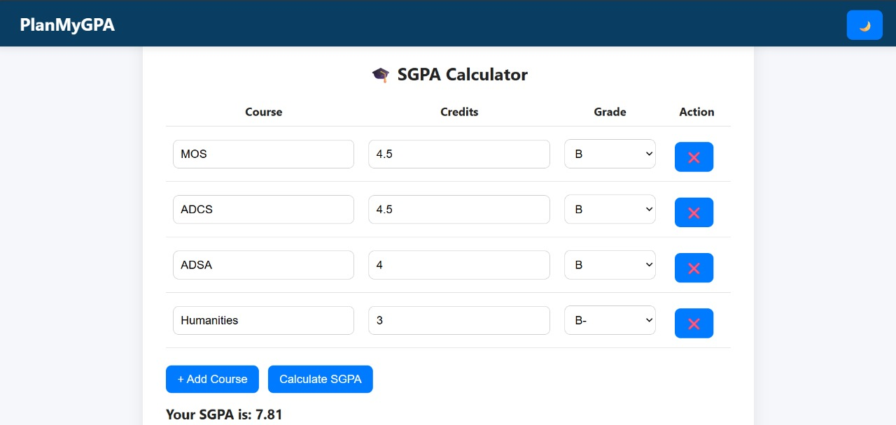

# 🎓 PlanMyGPA – GPA Calculator & Planner

A minimal, responsive GPA planning tool for students to calculate **SGPA**, update **CGPA**, and plan GPA improvement with ease. Built with **HTML, CSS, and JavaScript**, it features dark mode, real-time results, and auto-saving of inputs.

> 🎯 Created by a student, for students.

---

## 🚀 Features

- ✅ **SGPA Calculator**  
  Add subjects, select grades & credits, and instantly see your semester GPA.

- 📚 **CGPA Target Planner**  
  Set your goal CGPA and find the SGPA you’ll need next semester to achieve it.

- 🔄 **SGPA Impact Planner**  
  Predict how your CGPA will change after your next semester based on expected SGPA.

- 🌙 **Dark Mode**  
  Clean toggle to switch between dark and light modes.

---

## 📸 Preview

  

---

## 🛠️ Tech Stack

- **HTML5** – Structure  
- **CSS3** – Styling + Dark Mode  
- **JavaScript** – GPA Calculations, DOM Handling

---

## 💻 Live Demo

🔗 [Click here](https://plan-my-gpa.netlify.app/)  

---

## 🧠 How to Use

1. Fill in subjects, credits, and select grades.
2. Click **"Calculate SGPA"** to see your semester GPA.
3. Use the **CGPA Target Planner** to calculate the SGPA needed for your target CGPA.
4. Use the **SGPA Planner** to estimate your updated CGPA after next semester.
5. Toggle 🌙 to switch to dark mode.
6. All inputs will auto-save — no account/login needed.

---

## 👨‍💻 Author

**Sarthak Maheshwari**  
📧 [sarthakmaheshwari12a@gmail.com](mailto:sarthakmaheshwari12a@gmail.com)

---

## 📜 License

This project is licensed under the **MIT License**. 

---

© 2025 Sarthak Maheshwari
